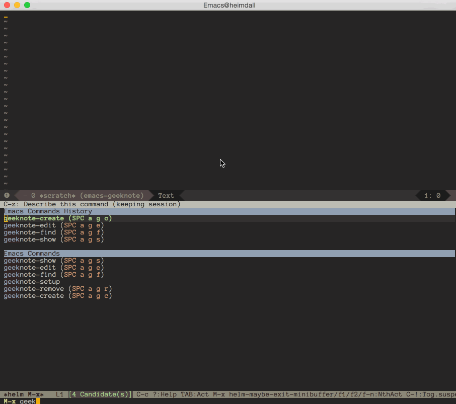
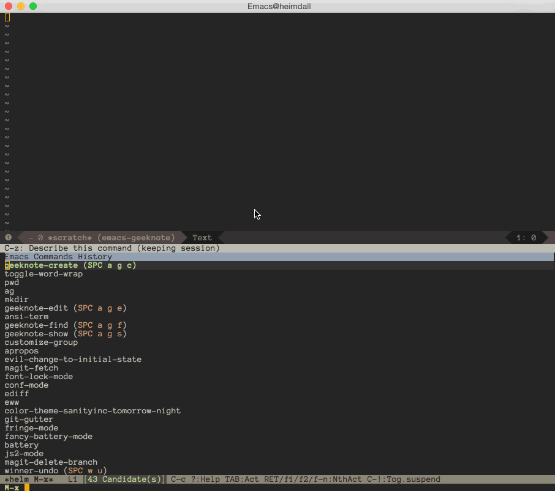
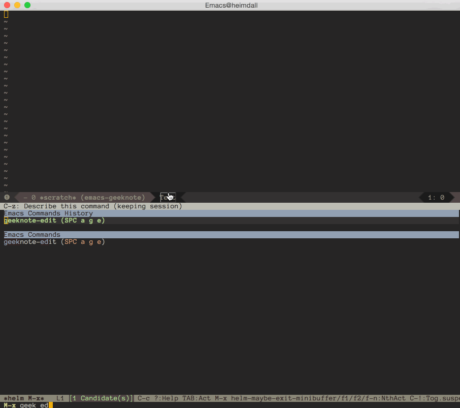
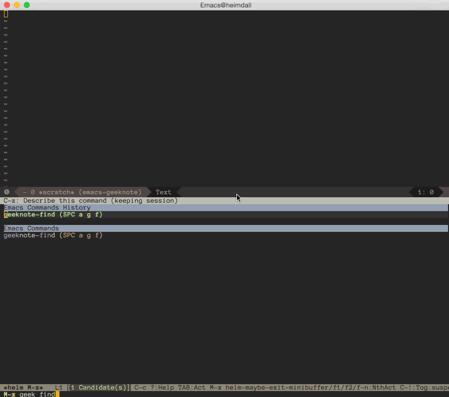
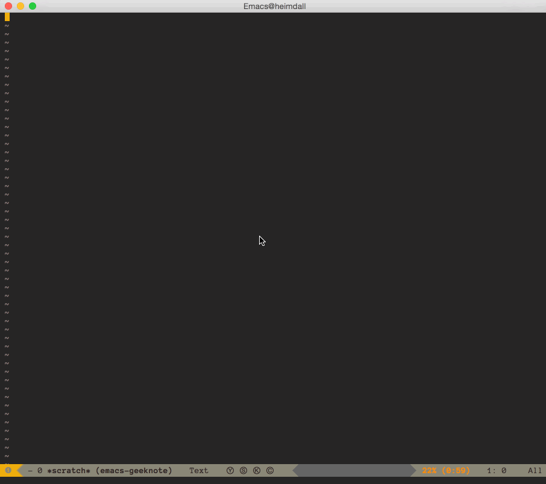
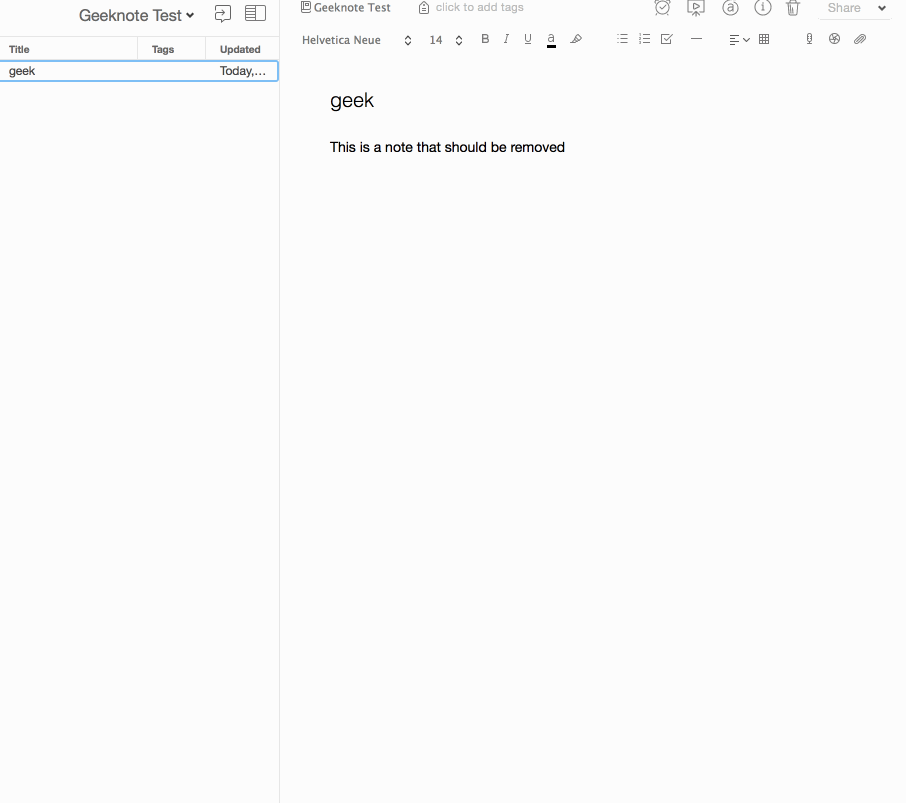
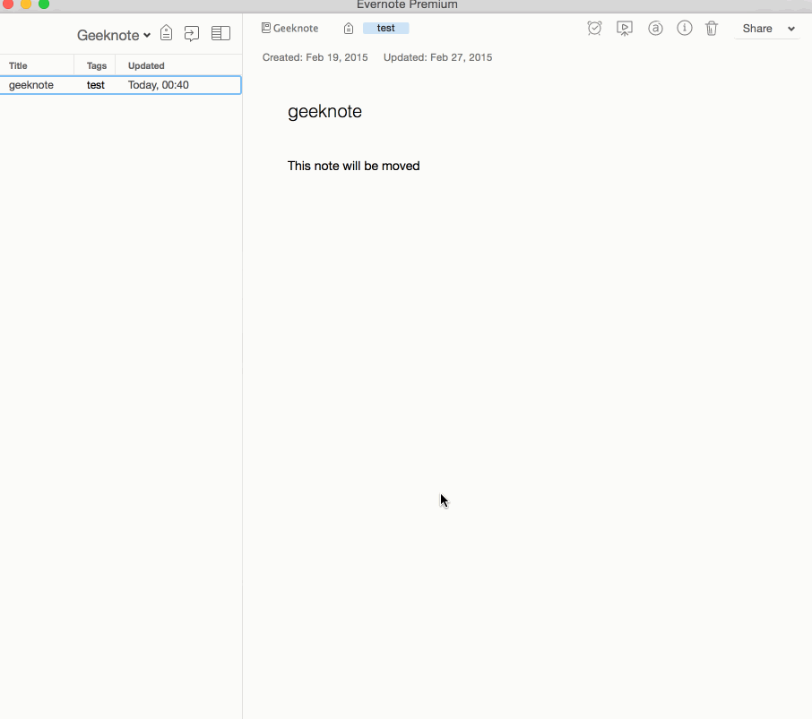
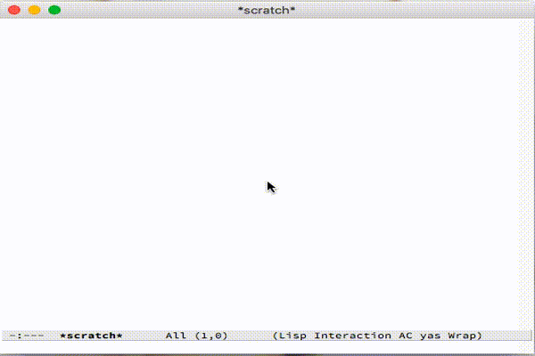

# geeknote.el

Use Evernote in Emacs through geeknote

## Dependencies

### Geeknote

This package assumes that you have the `geeknote` command in your `$PATH`.
To obtain this command, please refer to the official geeknote
[documentation](https://github.com/VitaliyRodnenko/geeknote).

Sometimes, geeknote `HEAD` will have bugs. If so, commit `192a0c5` is tested
to work properly. You can checkout that revision if needed.

### Emacs config

Because of the way `geeknote` works, it is expected that you have emacs running in
server or daemon mode. Either of the two should work:

```
# In your init.el/.emacs
(server-start)

# Or by running this in your shell
$ emacs --daemon
```

## Usage

### Configuration

It is recommended that the `geeknote` command is present in your `$PATH`. If so, no
further configuration is needed. However, if you would prefer to reference `geeknote`
from another location, you can do so by customizing the variable `geeknote-command`.

```
(setq geeknote-command "python ~/path/to/geeknote.py")
```

This package expects `emacsclient` to be defined as your geeknote editor. You can
set it up by running this command in your terminal:

```
$ geeknote settings --editor "emacsclient"
```

### Commands

#### Create

`geeknote-create`: Create a new note.



You can specify a notebook in the title string using the `@` prefix, like so:

```
notetitle @notebookname
```

Similarly, you can specify tags using the `#` prefix:

```
notetitle #tag1, tag2
```

This means you can create a note in your desired notebook and tag it in one shot:

```
notetitle @notebookname #tag1, tag2
```

If the notebook and the tags are non-existent, they will be created.


#### Edit

`geeknote-edit`: Edit a note by title or index.



Notes can be written in markdown. Most markdown are correctly displayed in Evernote.



#### Find

`geeknote-find`: Use a keyword to search notes by title and content.

The index of the results can be used as an argument to another
geeknote command.



#### Show

`geeknote-show`: Show a note in a non-editable Emacs buffer.



#### Remove

`geeknote-remove`: Delete a note.



#### Move

`geeknote-move`: Move a note to a different notebook.



#### Buffer Lists

`geeknote-notebook-list`: Show an interactive list of notebooks (top 100).
`geeknote-tag-list`: Show an interactive list of tags (top 100).



In the buffers, clicking or pressing `enter` will trigger a
find/search with that tag or with that notebook. Also there is some
key navigation bound to the `geeknote-mode`

```
 "q" kill-this-buffer
 "j" next-line
 "k" previous-line
```

### Indexes

Geeknote's indexes still work in this package. For example, you can search for a note
beforehand and use the note's index as an argument to `geeknote-edit`

```
# `geeknote-find` output
1: A note
2: The note you like to edit
3: Some other note

# `geeknote-edit` the second result
(geeknote-edit 2)
```

This also applies when a command is called interactively.

### Keybindings

This package does not define any keybindings at the moment. Feel free to define
your own keybindings for each command, like so:

```
(global-set-key (kbd "C-c g c") 'geeknote-create)
(global-set-key (kbd "C-c g e") 'geeknote-edit)
(global-set-key (kbd "C-c g f") 'geeknote-find)
(global-set-key (kbd "C-c g s") 'geeknote-show)
(global-set-key (kbd "C-c g r") 'geeknote-remove)
(global-set-key (kbd "C-c g m") 'geeknote-move)
```

## Alternatives/Inspiration

You can check out [evernote-mode](https://github.com/pymander/evernote-mode),
an Emacs package that integrates Evernote with org-mode. Sublime Text also has an
excellent Evernote [plugin](https://packagecontrol.io/packages/SublimeEvernote).
